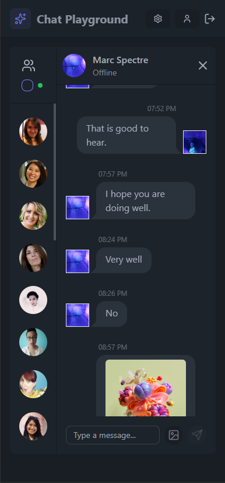

# Chat Playground

## Table of Contents

<!-- prettier-ignore-start -->

- [About The Project](#about-the-project)<br>
- [Demo](#demo)<br>
- [Tech Stacks](#tech-stacks)<br>
- [Setup](#setup)<br>
  - [Prerequisites](#prerequisites)<br>
  - [Installation](#installation)<br>
- [Repository Structure](#repository-structure)<br>

<!-- prettier-ignore-end -->

---

## About the Project

<picture>
  <source media="(min-width: 1280px)" srcset="./public/Desktop.png">
  <source media="(min-width: 768px)" srcset="./public/Tablet.png">
  
</picture>

I have built the real time chat app. The app can have different UI themes where the user feels comfortable with chatting. The user can send both texts and images to other users. Feel free to send the message or the meme that you like to Marc Spectre or Stephen Grant.

---

## Demo

You can access the demo [here](https://chat-playground-rtaw.onrender.com)

---

## Tech Stacks

- Frontend: React + TailwindCSS + DaisyUI + Zustand
- Language: JavaScript
- Backend: Node + Express
- Image Upload: Cloudinary
- Real-time Messaging: Socket.io
- Authentication: JSON Web Token
- Password Hashing: BCrypt
- Message Encryption: CryptoJS
- Database: MongoDB
- Hosting: Render

---

## Setup

### Prerequisites

- Node 22+
- MongoDB Cluster (Database)
- Cloudinary Configuration Variables
- Your Own Generated JSON Web Token Secret Key
- Your Own Generated AES-128 Encryption Key

### Installation

1. Fork the repository

2. Clone the repository

```
git clone https://github.com/abdulgilani/chat-playground
```

3. Install Dependencies

```
cd backend && npm i
cd ../frontend && npm i
```

4. Environment Setup

```
cp backend/.env.example backend/.env
cp frontend/.env.example frontend/.env
```

<!-- prettier-ignore-start -->

**Seed Fake Users To Make the UI Less Boring (Optional)**

<!-- prettier-ignore-end -->

```
node backend/src/seeds/user.seed.js
```

5. Production Build

```
npm run build
npm run start
```

Visit http://localhost:5000/api

---

## Repository Structure

```
/chat-playground
├── /backend
│   └── /src
│       ├── /controllers                    # Auth and Message Controllers
│       ├── index.js
│       ├── /lib
│       │   ├── cloudinary.js               # Cloudinary Configuration
│       │   ├── db.js                       # MongoDB Configuration
│       │   ├── socket.js                   # Socket.io Initialization
│       │   └── utils.js                    # Token generation
│       ├── /middleware                     # Authentication Middleware
│       ├── /models                         # User and Message Models
│       ├── /routes                         # Auth and Message Routes
│       └── /seeds
│           └── user.seed.js                # Fake User Seed File
│
├── /frontend
│   ├── index.html
│   ├── /src
│   │   ├── App.jsx                          # Main Routing Setup
│   │   ├── /components
│   │   │   ├── AuthImagePattern.jsx
│   │   │   ├── ChatContainer.jsx
│   │   │   ├── ChatHeader.jsx
│   │   │   ├── ChatInput.jsx
│   │   │   ├── Navbar.jsx
│   │   │   ├── NoChatSelected.jsx
│   │   │   ├── Sidebar.jsx
│   │   │   └── skeletons
│   │   │       ├── ChatSkeleton.jsx
│   │   │       └── SidebarSkeleton.jsx
│   │   ├── /constants
│   │   │   └── index.js                       # Array with different themes
│   │   ├── index.css
│   │   ├── main.jsx
│   │   ├── /pages
│   │   │   ├── HomePage.jsx
│   │   │   ├── LoginPage.jsx
│   │   │   ├── ProfilePage.jsx
│   │   │   ├── SettingsPage.jsx
│   │   │   └── SignUpPage.jsx
│   │   ├── /store
│   │   │   ├── useAuthStore.js
│   │   │   ├── useChatStore.js
│   │   │   └── useThemeStore.js
│   │   └── /utils
│   │       ├── axios.js
│   │       ├── date.js
│   │       └── encryption.js
│   ├── tailwind.config.js
│   └── vite.config.js
├── package.json
└── public
```
